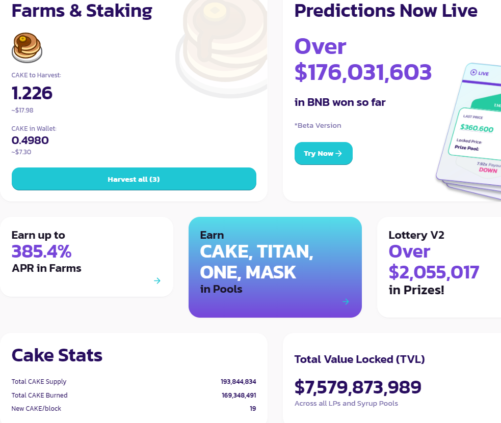
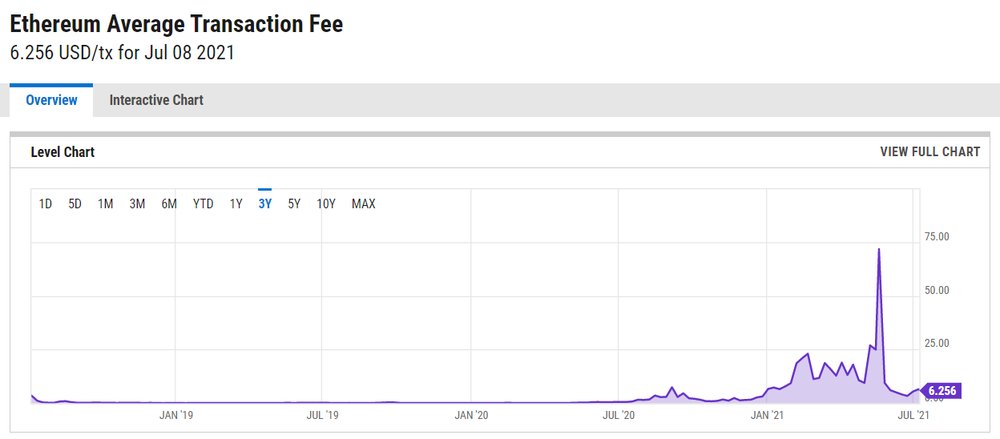
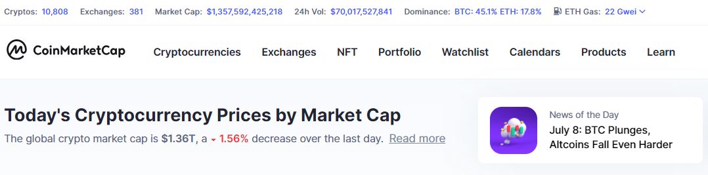
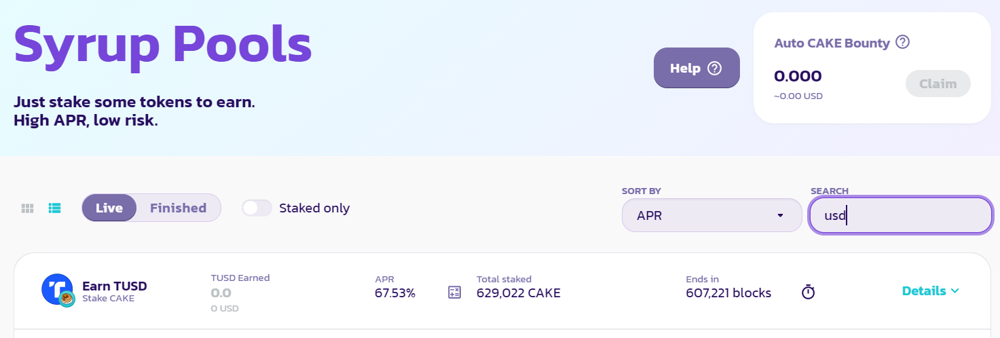
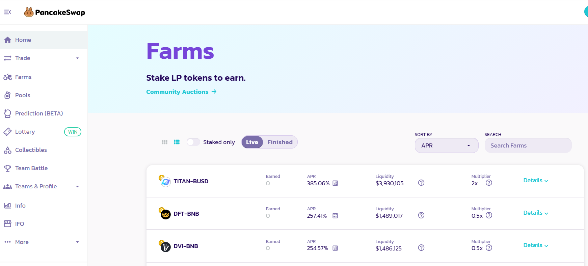
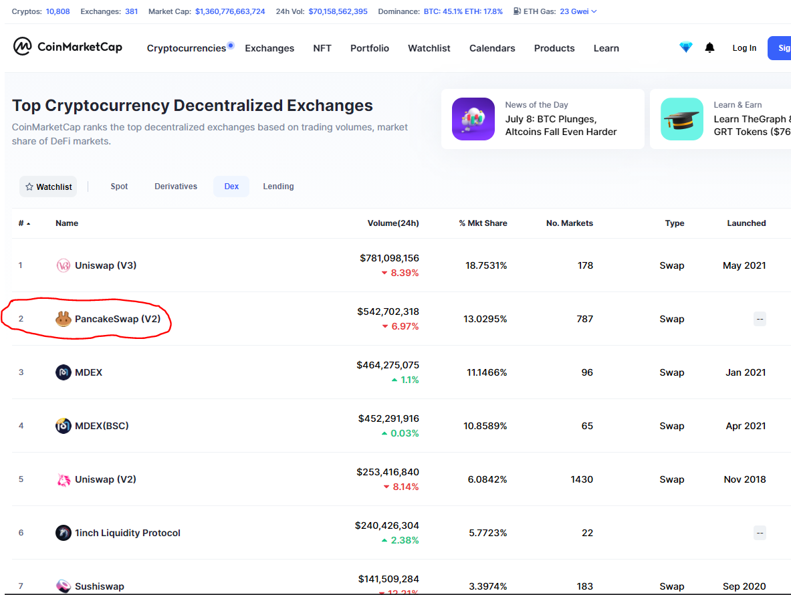
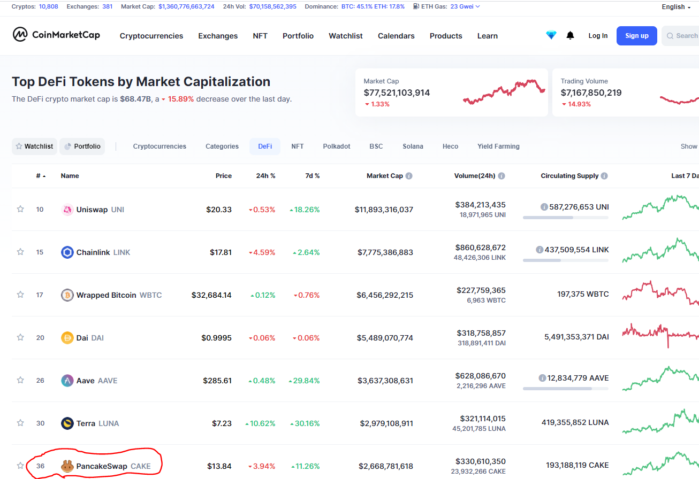
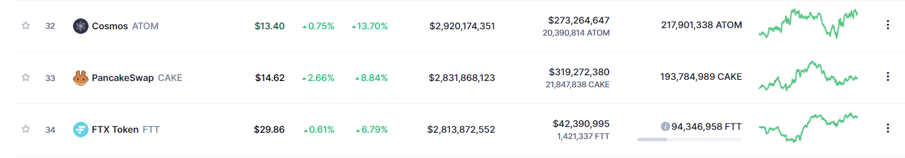
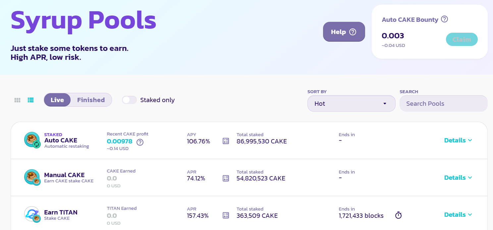
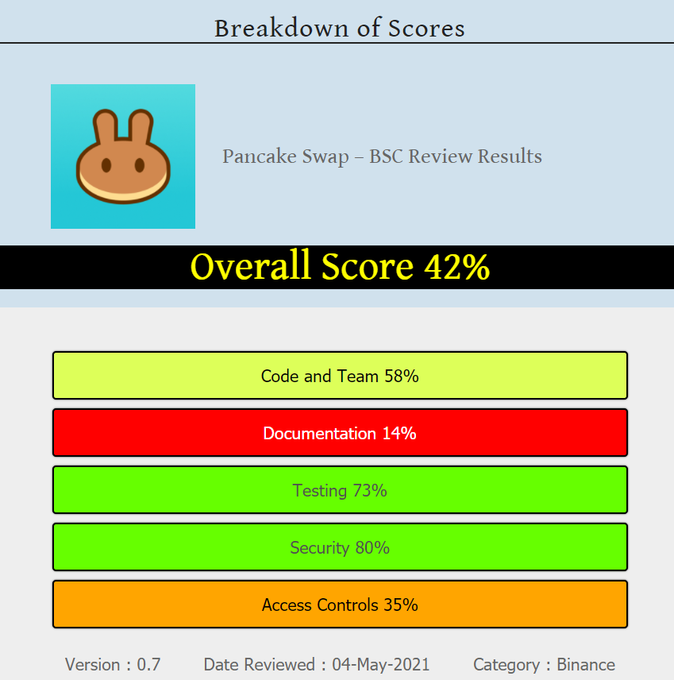

# FinTech Case Study - PancakeSwap

## Overview and Origin

* When was the company incorporated?

PancakeSwap was incorporated in September 2020.

* Who are the founders of the PancakeSwap?

The founders of the company are anonymous; however the only clue is that they like to eat pancakes and that is why they named the company PancakeSwap.

* How did the idea for the PancakeSwap come about?

The principle that PancakeSwap works on is primarily a crypto exchange. This operation is offered by many companies like
1. Binance
2. Bitrex
3. Kraken
4. Bitfinex

However these are centralized exchanges. PancakeSwap is a decentralized exchange, which is a relatively new concept of around 3 years. It is similar in functionality to SushiSwap or Uniswap which work on the Ethereum network, but unlike these two it runs on the Binance Smart Chain (BSC). 

* How is the company funded? How much funding have they received?

The company charges 0.2% for buy and sell exchange transactions of which 0.17% goes to liquidity providers and very modest 0.03% goes to PancakeSwap the company. 

In addition last December 2020 PancakeSwap was one of 15 companies to be given funding from Binance via its [$100 Million Accelerator Fund SupportsBooster grants](https://www.binance.com/en/blog/421499824684901149/UPDATE-%24100M-Accelerator-Fund-Supports-2-More-Projects)

## Business Activities:

* What specific financial problem is PancakeSwap trying to solve?

There are several problems PancakeSwap is addressing. 

Firstly, when creating a traditional cryptocurrency exchange the exchange owners must provide a great amount of liquidity to attract traders which then creates a market via their buy and sell order book. The more liquidity the more they can attract large traders. PancakeSwap, however, uses Automated Market Maker (AMM) strategy, where it offers high Annual Percentage Yields (APYs) to people who provide crypto liquidity in the form of crypto pairs. These clients are rewarded whenever an exchange transaction occurs.

The decentralized nature allows more stability against hacking and what should result in near continuous uptime compared to centralized exchanges.

The trading fees of 0.2% are extremely competitive compared to the standard fee of 1% on many centralized exchanges. However, the fees apply to both buying and selling.

* Who is PancakeSwap intended customer?  

There are several intended customers. One group are those who wish to earn interest on the crypto that they hold via liquidity pair farms or pools. Many search for high yields, while others are hodlers. Hodlers are people who hold onto their tokens or coins because they believe they will profit their price increase in the future. Yield farming can increase their holding more so by earning interest, this was not available until only a few years ago.

The second group of customers are those who are cryptocurrency traders. This platform offers competitive trading rates of 0.2% and exclusive newly released tokens.

Also, arbitrage traders use the AMM (explained below) behaviour to profit from token market price difference. 

In addition, there are people who want to launch new tokens or coins. In the past, to list your new crypto would typically be required to make payments from $10,000 to $60,000 USD on popular exchanges. PancakeSwap however, offers free listing on their exchange as long as you provide an initial liquidity pool pair, for example your coin paired with BUSD or BNB. 

Another feature appealing to many people is that the exchange does not require Know Your Customer (KYC), Anti Money Laundering (AML) or Counter Terrorism Financing (CTF) identification. It solely uses a connected crypto wallet with the only identifiable feature being your wallet's address which could be traced on the blockchain. 

Is there any information about the market size of this set of customers?

According to [Analytical Insight -DeFi Market Size](https://www.analyticsinsight.net/defi-market-size-declines-45-to-48-billion/), in June 2020, in the early days of DeFi, the market size was $1.85 billion USD based on the amount of cryptocurrency locked. By February 2021, that reached 46 billion USD, the all-time high hit $87 billion on 12th May. As you can see, this is and exponentially growing new financial market.

What solution does this PancakeSwap offer that their competitors do not or cannot offer? (What is the unfair advantage they utilize?)

PancakeSwap borrows much of its idea from popular Ethereum AMM like SushiSwap, Uniswap or 1inch. However, the growing popularity of these Ethereum based platforms has also been their downfall. The number of transactions on the Ethereum network has grown exponentially since the Cryptocurrency DeFi landscape started. This has resulted in a saturation of the transaction bandwidth of Ethereum which is only approximately 30 transactions a second. Due to this demand, Ethereum average transaction fee of 51 cents USD on 30 May 2020 increased to over 100-fold within a year to a peak of $71.72 USD on 19 May 2021. The current average is $6.25 USD.

The PancakeSwap advantage is that it uses Binance Smart Chain whose typical price for transactions is in the order of 30 cents USD, i.e. 20 times less that Ethereum. Also, the speed of transaction settlement is in the order of 5 to 15 seconds as opposed to Ethereum’s 15 sec up to 15 minutes. 

The issue of an exchange needing to provide a large pool of liquidity, especially when initially starting, was addressed by PancakeSwap by using the concept of Automated Market Maker (AMM). AMM is a concept that was introduced by Bancor in 2018. 

There is a quote commonly used in the crypto environment “Not your keys, not your money”. This is in reference to most centralized crypto exchanges allowing you to create crypto addresses on their site, however, the private keys which allow access to the funds via the blockchain are held by them. If that site gets hacked or the operators are untrustworthy you could lose your money. PancakeSwap uses your wallet directly with your permission, however you still hold the keys to your crypto, they don’t. This is very appealing to most knowledgeable crypto holders as they are the ones responsible when it comes to access to their funds and funds are not moved on and off exchanges which generally involves a fee.

PancakeSwap allows you to trade solely based on your crypto wallet address as a unique identifier and having funds in that wallet. There is no Know You Customer (KYC), Anti Money Laundering (AML) or Counter Terrorism Financing (CTF) checks conducted. However, a whole new industry of Crypto based Oracles is emerging to employ these types of validation services if required. The fact that PancakeSwap is decentralised, and the creator/owners are anonymous makes it extremely difficult for any national government around the world to enforce laws requiring these forms of checks. For many people who participate in PancakeSwap it means that the signing up to use PancakeSwap is fast and convenient without having to fill in forms and supply photo IDs for which the centralized exchange can occasionally be compromised via hacking. 

* Which technologies is PancakeSwap currently using, and how are they implementing them? 

The major technology that PancakeSwap uses is the blockchain. All transactions are carried out by utilizing smart contract which are executed on the blockchain network of Binance Smart Chain. These contracts are typically less than 50 cents and take less than 5-15 seconds to execute.

The AMM is another technology that provides rapid liquidity growth. It works in the following manner. High Annual Percentage Yields are offered to attract token funding. These clients who fund are called liquidity providers (LP). Say that the liquidity providers create a USDT-ETH pair and let us say the total liquidity staked is $100,000 USDT against a balanced $100,000 worth of Ethereum. Then if 2% of Ethereum is purchased on this exchange then the remaining Ethereum pool is worth 2% more. This is how a crypto coin or token achieves a market value as opposed to buy and sell book order that other exchanges use. 

AMM also provides an opportunity for arbitrage traders to take advantage of the imbalance and profit by selling market price Ethereum via the PancakeSwap exchange. This results in increased trade.  

Another major technology being used by PancakeSwap is decentralisation. PancakeSwap’s backend operations uses BSC which has decentralised nodes around the world that verify and execute contracts. This ensures reliable uptime as an attack on one node does not bring down the whole network or the application.

## Landscape:

* What domain of the financial industry is PancakeSwap in?

PancakeSwap falls under the major FinTech domain of Cryptocurrencies. PancakeSwap uses a cryptocurrency called Cake as its primary utility. The subcategory is decentralised finance (DeFi). 

As part of its ecosystem there are several subcategories of DeFi. Primarily, it acts as a decentralised exchange (DEX)but it also has Crypto Yield Farming (or sometimes called Liquidity Mining) via its automatic market maker (AMM), both being further subcategories of DeFi. 

* What have been the major trends and innovations of this domain over the last 5-10 years?

Crypto currencies started with Bitcoin in 2009, less than 12 years ago. Since then, total cryptocurrency market capitalisation has grown to a peak of $1.8 trillion USD. There are over 10,800 cryptocurrencies and over 380 exchanges.

 Over the last five years cryptocurrencies have moved away from being primarily for currency use. In the last six years since Ethereum was created, the use of smart contracts have inspired many new ideas revolving around providing financial services on a digital platform. Hence the rise of DeFi in the last four to five years. In the last three years automated market makers have come into being. Decentralised exchanges have also started in the last three years.

* What are the other major companies in this domain?

In the decentralised Exchange domain there several competitors. 
The main one being Uniswap. It is the largest DEX and was created by Hayden Adam with a lot of input by Vitalik Buterin the creator of Ethereum. It has many LP pairs and very good liquidity. Technically, anyone can create a LP which has led to some fraudulent activity.

MDEX is another DEX and it has risen in popularity as it has an exchange on both the Ethereum and Binance Smart Chain networks. When you add the volumes together technically it is the biggest DEX.

SushiSwap was created via a fork of Uniswap. It gained popularity due to its high APYs, its easy interface and its use of food naming convention for various parts of its operation.

1inch is an up-and-coming DEX which is trailing just behind PancakeSwap.

With regards to Yield Farming and Pools, there are many competitors. BlockFi is a very respected company catering to the traditional financial market. It is low risk and hence it offers various popular cryptos like Bitcoin, Ethereum etc at interest rates of between 5-9%, which is better than a traditional bank. 

Other companies that are more Crypto domain based with high yielding APYs are Compound, Aave, Maker, Avalanche and Yearn.Finance to name a few.

## Results

* What has been the business impact of PancakeSwap so far?
 
In what amounts to only ten months of operation, PancakeSwap is often the second biggest DEX. It often claims number one spot as a DEX against the leader Uniswap. On the 10th of July 2021 PancakeSwap is rated number 10 as the biggest exchange in the world. Binance, which is the biggest central cryptocurrency exchange, created the Binance Smart Chain platform which PancakeSwap has been built upon.

In PancakeSwap’s monthly report posted on [PancakeSwap.medium.com](https://PancakeSwap.medium.com/) states

June 2021
Overall
Total Volume: $19.170B
Average Daily Volume: $639M
Unique traders: 1.98M
Unique users: 9.54M 

That would mean that liquidity providers and pool stakers are earning and $10.8 million USD a day. PancakeSwap itself would be earning a gross profit of $191,700, a day, which is $5.75 million a month.

With regards to annual percentage yields (APY), it has very impressive yields. The syrup pools which involve staking Cake to earn other coin or tokens, offers impressive double digit APYs. Staking Cake to earn Cake currently offers 106% compounding interest. For more certainty, you can stake cake to earn TUSD stable coin at 67.5%.

Farms are where crypto stakers provide liquidity pools. To do this you must stake in pairs. When a coin pair is initially released it is not uncommon for that pair to earn over 1000% interest, this is to attract funds from clients to provide a large liquidity pool. Of course, this high APY rapidly falls in the following days and weeks to generally settle somewhere in the range of 100 to 200% APY.

* What are some of the core metrics that companies in this domain uses to measure success? How is your PancakeSwap performing, based on these metrics?

Some of the core metrics used in this cryptocurrency trading industry are: - Trading Volume, Average Liquidity, Weekly Visits, Liquidity Provider Pairs, and number of tokens and coins offered for exchange, and the number of Stablecoins or Fiat currencies supported.

With regards to Farming and Pools, metrics used are Annual Percentage Yield, Liquidity or Total Value Locked, Liquidity pools, Liquidity Provider Pairs

* How is your PancakeSwap performing relative to competitors in the same domain?

PancakeSwap rates number 10 in the top exchanges 
and number 2 as a decentralised exchange. 

It is placed number 7 in the DeFi ranking

Cake, the utility used on the PancakeSwap platform has is rated 33 out of 10,800 cryptocurrencies for its market capitalization of 2.83 billion USD.

## Recommendations

* If you were to advise PancakeSwap, what products or services would you suggest they offer? 

It has only been in the last two months that PancakeSwap has offered compounding interest on only one token, cake. It returns a significanly better APY that the non compounding Cake.It would be beneficial to users to provide auto compounding interest on many of the other tokens offered on the pool site. Also, along the same lines it would be beneficial to have an auto-harvesting function on the farms that reap the reward via harvesting when a specified value or amount of cake token is earned. This compounding effect will present itself as better APYs.

Secondly, the procedure of transferring cryptocurrencies to the Binance smart chain and converting it is complicated and dangerous. Many people transfer funds from the ERC 20 Ethereum main net. There is a procedure which involves a bridge to the Binance smart chain and if this is not followed then coins sent could be permanently lost as the networks are incompatible. YouTube is full of instructions on how to retrieve ERC20 tokens sent by accident to the by Binance Smart Chain network (see here [You Tube "Recover Etherium sent to BSC"](https://www.youtube.com/results?search_query=recover+erc20+from+binance+smart+chain) ). A simpler interface should be designed to avoid this possibility of loss.

When providing liquidity pairs, the danger is that the increase or decrease in price of any one of the paired tokens can result in impermanent loss. However, impermanent loss will generally only be a problem when selling the pair and realising the lost value. To minimise this effect, and decrease the risk of financial loss, it is wise to stake in a liquidity pool that has one pair which is a stable coin. This will result in lower interest rates, however it is safer. 

I would advise that the company should clearly state this to users of its service. I would also advise that it posts figures that accurately show if the impermanent loss has exceeded the interest earnings on staked funds. This would lead to a more positive user experience rather than users being fooled into chasing yields, often in the high 800% APY, resulting in higher impermanent loss that APY earnings. In its defence however, PancakeSwap offers several Stablecoin-Token pairs and also a Stablecoin-Stablecoin pair which are far less prone to impermanent loss.

Finally, having used the site a number of times, I would suggest that the present system for staking coins in a liquidity pool involves too many steps. Firstly, half of the deposited crypto token or coin needs to be converted to one of the pairs. Then the remaining half needs to be exchanged for the second pair. At times due to the time taken to process the token swap there will be a discrepancy in the value of the token, always resulting in some small amount of one token being left behind for the sake of balancing the pair. PancakeSwap should offer the facility where payment can be made using one token to purchase an equal amount of the two LP tokens in one transaction. Then, stake the LP token in an LP farm rather then up to five transactions which is the current process.

* Why do you think that offering this product or service would benefit PancakeSwap?

Compounding interests results in more attractive APY, hence the company may attract more customers.

Simplifying transfers from ERC 20 Ethernet Ethereum mainnet to the BSC will result in less frustration and worry on the part of a customer who has lost funds in their attempt to move funds to the BSC wallet for the purpose of PancakeSwap transactions.

The quick one step transaction of paying for a LP pair will also provide a better user experience.

* What technologies would this additional product or service utilize?

Compounding interest and quick one-step transactions can be programmed into the current framework of the software being used.

Preventing loss by sending ERC20 tokens to the binding smart chain would need to incorporate new upcoming bridging solutions.

* Why are these technologies appropriate for your solution?

One of the [biggest proposed bridging solutions is that presented by Polkadot](https://coinmarketcap.com/alexandria/article/what-are-blockchain-bridges), a cryptocurrency platform that claims to be the blockchain of blockchains. It is now ranked in the top ten cryptocurrencies. It promises to provide compatibility between blockchains and hence result in further decentralisation within the crypto ecosystem.

The Polkadot solution is to use Polkadot smart contracts to simplify the movement of something like ERC20 tokens to the BSC and vice versa.  The vast majority of the DeFi applications currently run on the Ethereum network. This link would mean PancakeSwap will have access to a larger customer base.

* Positives and negatives of PancakeSwap.

When reviewing other aspects of PancakeSwap, a large negative is that on November 12, 2020, it was publicly revealed on [BSC News-PancakeSwap Emergency Brake](https://www.bsc.news/post/pancakeswap-emergency-brake-on-syrup-pools) that a flaw in a contract used for Syrup, the PancakeSwap governance token, resulted in an exploit used by hackers to illegally gain Cake. It is concerning that this was exploited for three weeks without detection. Of further concerns is that the contracts were audited by Certik, however after the initial audit only changes in the contract (delta audits) were conducted.  

On the positive side, they are legitimate enough to have instigated regular audit checks and now I would assume they no longer do delta audits. This would have to be a necessity as the other positive is they were insured. This breach revealed that delta audits are not recognized by the insurance company. 

Another negative according to a [Coin Telegraph](https://cointelegraph.com/news/PancakeSwap-cake-aims-to-take-a-slice-out-of-uniswap-s-defi-dominance), Cake does not have a hard cap. This means that the creators can flood the market with unlimited new Cake. At the time of printing that article, 28 March, the Cake inflation rate stood at 37%. However, there was a submission put forward to reduce the weekly created supply by 20% which was likely to be passed. Today, Cake’s price is $14.56, which is one third of its all time high (ATH) of $43.92 on 30 April, slightly lower than most cryptos which are presently approx. 35-45% of their ATH.

Another negative is that this site [DeFi Safety](https://defisafety.com/2021/05/04/pancake-swap-binance/) rates PancakeSwap low at 42%. I feel that this is not accurate based upon its success, Binance backing, insurance and auditing.

Finally, a possible negative is the claim by Youtuber Crypto Tips that the Binance Smart Chain network is not very decentalised. She claims it only has a few nodes that seem to run in synch rather that randomly. This may be the case, however the great success that BSC is experiencing now will most likely see the expansion of the nodes.

A positive is that PancakeSwap appears to be heavily linked to Binance as it is the number one application running on BSC and it also uses BNB token for its smart contract. This gives increasing credibility and confidence in the BSC. PancakeSwap also has numerous BNB, BUSD token liquidity pairs. We can conclude that it is in Binance’s interest that PancakeSwap runs successfully and survives.

Other positives are that the APYS offered on PancakeSwap appear to be relatively high and long lasting compared to other DeFi Yield Farms and Pools. Also, the user interface and the speed of transactions provide a great user experience. This highlights that this decentralized and blockchain application is “state of the art” and can now match the usability of centralized applications often surpassing in areas of security and trust.

References

https://www.binance.com/en/blog/421499824684901149/UPDATE-%24100M-Accelerator-Fund-Supports-2-More-Projects

https://www.thestreet.com/crypto/ethereum/ethereum-2-upgrade-what-you-need-to-know 

https://PancakeSwap.medium.com/

https://coinmarketcap.com/currencies/PancakeSwap/ 

https://coinmarketcap.com/alexandria/article/what-are-blockchain-bridges 

https://www.bsc.news/post/PancakeSwap-emergency-brake-on-syrup-pools 

https://cointelegraph.com/news/PancakeSwap-eclipses-ethereum-network-in-24-hour-transactions 

https://defisafety.com/2021/05/04/pancake-swap-binance/ 

YouTube
Crypto Lark “Binance Chain Exploding! Here’s 3 Low Cap BSC Altcoin Gems”  https://www.youtube.com/watch?v=D3-JCQIVYFw&t=67s 

BitBoy Crypto “Top Undervalued Altcoin (PancakeSwap Price Prediction 2021)”
https://www.youtube.com/watch?v=MbiPBdAKZh4 

JNRY Crypto “PancakeSwap Tutorial - Fees Under 50 Cents!! Binance Smart Chain” https://www.youtube.com/watch?v=NDbsgb_X9IA 

Crypto Tips “What No One is Saying About Pancake Swap (CAKE)”
https://www.youtube.com/watch?v=fIsV6KXlDVk&t=209s 

